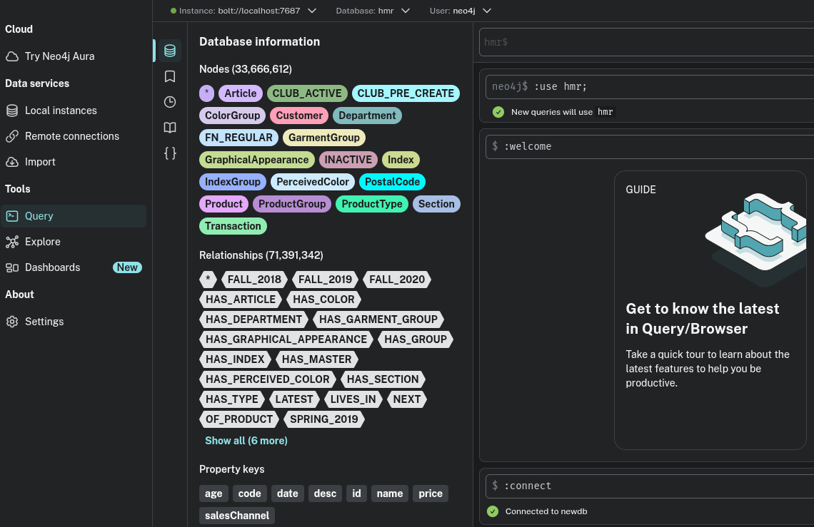

# langchain4j_ollama_graphaugment 
 
# dnf5 
# Docker 
sudo dnf config-manager addrepo --from-repofile=https://download.docker.com/linux/fedora/docker-ce.repo 
 
sudo dnf install docker-ce docker-ce-cli containerd.io docker-buildx-plugin docker-compose-plugin 
sudo systemctl enable --now docker 
sudo docker run hello-world 
 
#sudo groupadd docker 
sudo usermod -aG docker $USER 
 
# cd tmp 
# wget -O docker-desktop-x86_64.rpm https://desktop.docker.com/linux/main/amd64/docker-desktop-x86_64.rpm?utm_source=docker&utm_medium=webreferral&utm_campaign=docs-driven-download-linux-amd64
# sudo dnf install ./docker-desktop-x86_64.rpm
 
Register on site and Download data from https://www.kaggle.com/c/h-and-m-personalized-fashion-recommendations/overview 
articles.csv.zip 
customers.csv.zip 
transactions_train.csv.zip 
 
Recommend using Podman Desktop and podman-compose.yml 
(Docker Desktop sometimes hangs on my laptop) 
 
sudo dnf -y install podman podman-compose 
sudo systemctl enable --now podman.socket 
flatpak install flathub io.podman_desktop.PodmanDesktop 
 
podman compose -f ./podman-compose.yml up -d 
 
UnZip data and copy to ./neo4j_home/import 
 
You must recreate container after copy files to neo4j_home/import  
(docker specific snapshot file system when create container) 
 
create db in neo4j Enterprise from Neo4j Desktop 
:use system; 
CREATE DATABASE hrm; 
:use hrm; 
 
Run Cypher query in Neo4j Desktop from dbscripts directory. 
01-customer_indexes.cql 
... 
07-get-one-customer-summer-2019-purchases.cql 
 

 
mvn clean install 
or 
./mvnw clean install 
 
Run from IDE or command 
./mvnw spring-boot:run 

